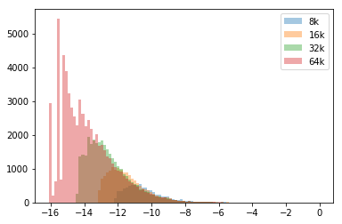

```python
%load_ext autoreload
```

    The autoreload extension is already loaded. To reload it, use:
      %reload_ext autoreload


```python
import os
import time
from fastai.text import *
```


```python
import sys
sys.path.append('./imdb_scripts/')

```


```python
from create_toks import *
import sentencepiece as spm
from fastai.text import *
import math
```


```python
sp64_lower = spm.SentencePieceProcessor()
sp64_lower.Load('data/imdb_lm_spm/model_64k_lowercase.model')
```


    True


```python
sp32_lower = spm.SentencePieceProcessor()
sp32_lower.Load('data/imdb_lm_spm/model_32k_lowercase.model')
```


    True


```python
sp16_lower = spm.SentencePieceProcessor()
sp16_lower.Load('data/imdb_lm_spm/model_16k_lowercase.model')
```


    True


```python
sp8_lower = spm.SentencePieceProcessor()
sp8_lower.Load('data/imdb_lm_spm/model_8k_lowercase.model')
```


    True


```python
import pandas as pd
```

# Vocabuary Statistics


```python
def getVocabCount(vsize):
    vocab_f_str = 'data/imdb_lm_spm/model_'+ str(vsize) +'k_lowercase.vocab'
    vocabnum = []
    with open(vocab_f_str, 'r') as f: 
        vocabnum = f.readlines()
    print(f'Last 25 words included by {vsize}k vocab model:')
    print(vocabnum[-10:])
    print('-----------------------')
    return np.array([float(vn.split()[-1]) for vn in vocabnum])
```


```python
v_counts = []
vocabs = [8, 16, 32, 64]
min_prob = 0
for i in vocabs: 
    v_count = getVocabCount(i)
    v_counts = v_counts + [v_count]
    min_prob = min(min_prob, np.min(v_count))
    
```

    Last 25 words included by 8k vocab model:
    ['▁administration\t-12.1174\n', '▁applause\t-12.1174\n', '▁humiliate\t-12.1174\n', '▁lubitsch\t-12.1174\n', '▁pfeiffer\t-12.1174\n', '▁stephanie\t-12.1174\n', '▁swift\t-12.1174\n', 'worst\t-12.1229\n', '▁complicat\t-12.1246\n', '▁miyazaki\t-12.1282\n']
    -----------------------
    Last 25 words included by 16k vocab model:
    ['▁infuriate\t-13.1477\n', '▁kessler\t-13.1477\n', '▁uninterested\t-13.1477\n', '▁veidt\t-13.1477\n', '▁zelah\t-13.1477\n', '▁albino\t-13.1477\n', '▁goliath\t-13.1477\n', '▁squire\t-13.1477\n', '▁(1997)\t-13.1477\n', '▁edmond\t-13.1477\n']
    -----------------------
    Last 25 words included by 32k vocab model:
    ['▁antonietta\t-14.423\n', '▁appetizing\t-14.423\n', '▁aronofsky\t-14.423\n', '▁atlantean\t-14.423\n', '▁barjatya\t-14.423\n', '▁bierko\t-14.423\n', '▁borchardt\t-14.423\n', '▁bostwick\t-14.423\n', '▁brettschneider\t-14.423\n', '▁broinowski\t-14.423\n']
    -----------------------
    Last 25 words included by 64k vocab model:
    ['▁etahn\t-16.1253\n', '▁ethnocentrism\t-16.1253\n', '▁eubanks\t-16.1253\n', '▁evanescence\t-16.1253\n', '▁evigan\t-16.1253\n', '▁exagerated\t-16.1253\n', '▁excrutiating\t-16.1253\n', '▁expatiate\t-16.1253\n', '▁expiation\t-16.1253\n', '▁expresion\t-16.1253\n']
    -----------------------


```python
bins = np.linspace(min_prob, 0, 100)
```


```python
for c, size in zip(v_counts, vocabs):
    plt.hist(c, bins, alpha=0.4, label=str(size) + 'k')
plt.legend(loc='upper right')
plt.show()
```





# tokenizing power


```python
milton_lower = "OF Mans First Disobedience, and the Fruit \n" + \
"Of that Forbidden Tree, whose mortal tast  \n" +  \
    "Brought Death into the World, and all our woe,  \n" +  \
    "With loss of Eden, till one greater Man  \n" +  \
    "Restore us, and regain the blissful Seat, \n" +  \
    "Sing Heav'nly Muse, that on the secret top  \n" +  \
    "Of Oreb, or of Sinai, didst inspire  \n" +  \
    "That Shepherd, who first taught the chosen Seed,  \n" +  \
    "In the Beginning how the Heav'ns and Earth  \n" +  \
    "Rose out of Chaos: or if Sion Hill  \n" +  \
    "Delight thee more, and Siloa's brook that flow'd  \n" +  \
    "Fast by the Oracle of God; I thence  \n" +  \
    "Invoke thy aid to my adventrous Song,  \n" +  \
    "That with no middle flight intends to soar  \n" +  \
    "Above th' Aonian Mount, while it pursues  \n" +  \
    "Things unattempted yet in Prose or Rhime. "
```


```python
milton_lower = milton_lower.lower()
```


```python
def printEncodedSentence(tokenizer, sentence):    
    print(''.join([' ' + s[1:] if (s[0]=='▁') else '-' + s for s in tokenizer.EncodeAsPieces(milton_lower)]))

```


```python
vocabs = [8, 16, 32, 64]
sps = [sp8_lower, sp16_lower, sp32_lower, sp64_lower]
```


```python
for v, sp in zip(vocabs, sps):
    print(f'tokenizer {v}k vocab')
    printEncodedSentence(sp, milton_lower)
    print('------------------------------------')
```

    tokenizer 8k vocab
     of man-s first dis-ob-ed-i-ence-, and the fruit -
    -of that for-bi-d-den tree-, who-se mortal ta-s-t -
    -b-rough-t death into the world-, and all our wo-e-, -
    -with loss of e-den-, till one greater man -
    -re-store us-, and regain the bliss-ful seat-, -
    -s-ing he-av-'-n-ly mu-se-, that on the secret top -
    -of or-e-b-, or of sin-a-i-, did-s-t inspire -
    -that shepherd-, who first taught the chosen see-d-, -
    -in the beginning how the he-av-'-ns and earth -
    -ro-se out of chaos-: or if -s-ion hill -
    -de-light the-e more-, and si-lo-a-'-s -brook that flow-'-d -
    -fa-s-t by the or-a-cle of god-; i the-nce -
    -in-vo-ke th-y aid to my a-d-ven-t-rous song-, -
    -that with no middle flight intend-s to so-ar -
    -a-bo-ve th-' a-on-ian mount-, while it pursue-s -
    -th-ing-s un-at-t-empt-ed yet in pro-se or r-hi-me-.
    ------------------------------------
    tokenizer 16k vocab
     of man-s first dis-ob-ed-i-ence-, and the fruit -
    -of that forbidden tree-, who-se mortal ta-s-t -
    -b-rough-t death into the world-, and all our woe-, -
    -with loss of ed-en-, till one greater man -
    -re-store us-, and regain the blissful seat-, -
    -s-ing he-av-'-n-ly muse-, that on the secret top -
    -of or-e-b-, or of sin-a-i-, did-s-t inspire -
    -that shepherd-, who first taught the chosen seed-, -
    -in the beginning how the he-av-'-ns and earth -
    -rose out of chaos-: or if -s-ion hill -
    -de-light the-e more-, and sil-o-a-'-s -brook that flow-'-d -
    -fast by the or-a-cle of god-; i the-nce -
    -in-vo-ke -thy aid to my advent-rous song-, -
    -that with no middle flight intend-s to so-ar -
    -a-bo-ve th-' a-on-ian mount-, while it pursue-s -
    -thing-s un-at-t-empt-ed yet in pro-se or r-hi-me-.
    ------------------------------------
    tokenizer 32k vocab
     of man-s first dis-ob-ed-i-ence-, and the fruit -
    -of that forbidden tree-, who-se mortal ta-s-t -
    -b-rough-t death into the world-, and all our woe-, -
    -with loss of eden-, till one greater man -
    -re-store us-, and regain the blissful seat-, -
    -s-ing he-av-'-n-ly muse-, that on the secret top -
    -of or-eb-, or of sin-a-i-, did-s-t inspire -
    -that shepherd-, who first taught the chosen seed-, -
    -in the beginning how the he-av-'-ns and earth -
    -rose out of chaos-: or if -s-ion hill -
    -de-light the-e more-, and sil-o-a-'-s brook that flow-'-d -
    -fast by the oracle of god-; i the-nce -
    -in-vo-ke -thy aid to my advent-rous song-, -
    -that with no middle flight intends to soar -
    -above th-' a-on-ian mount-, while it pursues -
    -things un-attempt-ed yet in prose or r-him-e-.
    ------------------------------------
    tokenizer 64k vocab
     of man-s first disobedience-, and the fruit -
    -of that forbidden tree-, who-se mortal tas-t -
    -brought death into the world-, and all our woe-, -
    -with loss of eden-, till one greater man -
    -re-store us-, and regain the blissful seat-, -
    -s-ing he-av-'-n-ly muse-, that on the secret top -
    -of or-eb-, or of sina-i-, did-s-t inspire -
    -that shepherd-, who first taught the chosen seed-, -
    -in the beginning how the he-av-'-ns and earth -
    -rose out of chaos-: or if -sion hill -
    -de-light the-e more-, and silo-a-'-s brook that flow-'-d -
    -fast by the oracle of god-; i the-nce -
    -invo-ke -thy aid to my advent-rous song-, -
    -that with no middle flight intends to soar -
    -above th-' a-on-ian mount-, while it pursues -
    -things un-attempted yet in prose or rhi-me-.
    ------------------------------------

